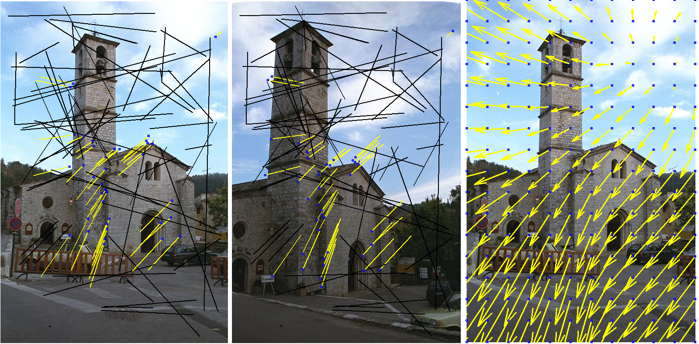

This is the Matlab code of EMDQ, we also included other methods that used in the experiments in the paper.

Try demo_2D.m in the "code" folder

Please cite the following paper if the code helps.

Zhou, Haoyin, and Jagadeesan Jayender. "Smooth Deformation Field-based Mismatch Removal in Real-time." arXiv preprint arXiv:2007.08553 (2020). 

